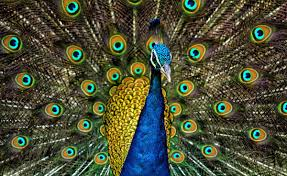
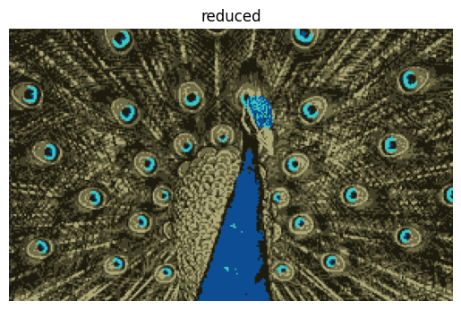
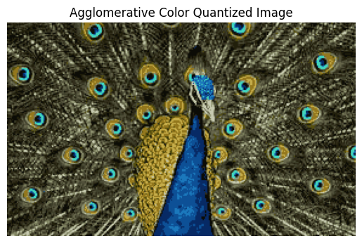

# Image Color Quantization using Clustering

This project demonstrates image color quantization — reducing the number of distinct colors in an image — using unsupervised machine learning techniques like **K-Means** and **Agglomerative Clustering**. It effectively compresses images while preserving visual quality.

---

## 📌 Overview

Color quantization reduces the number of colors in an image, making it smaller and faster to process. This is commonly used in:
- Image compression
- Graphics rendering
- Machine learning preprocessing

We use:
- **K-Means Clustering** — fast and efficient
- **Agglomerative Clustering** — hierarchical, better edge preservation

> DBSCAN was also explored but excluded due to performance limitations.

---

## 🚀 How It Works

1. **Load the image** and reshape it into a 2D array of pixels (RGB values).
2. **Normalize** pixel values to range [0, 1].
3. **Apply clustering**:
   - For K-Means: directly fit and predict pixel clusters.
   - For Agglomerative: fit on a sample of pixels, classify the rest using Nearest Centroid.
4. **Assign colors** to each pixel based on the cluster centroid.
5. **Reconstruct the quantized image** and display the results.

---

## 📊 Clustering Algorithms Used

| Algorithm       | Method                                               | Notes                                 |
|-----------------|------------------------------------------------------|----------------------------------------|
| K-Means         | `sklearn.cluster.KMeans`                             | Fast & widely used                     |
| Agglomerative   | `sklearn.cluster.AgglomerativeClustering` + `NearestCentroid` | Hierarchical, preserves structure |
| DBSCAN          | Tried but removed                                    | Poor results on pixel data             |

---

## 🖼️ Sample Output

| Original Image | K-Means (16 colors) | Agglomerative (16 colors) |
|----------------|---------------------|----------------------------|
|  | ** | ** |

---
### 🎯 Agglomerative Clustering

**Advantages:**
- ✅ Captures color hierarchy better in some images
- ✅ No strict need to predefine the number of clusters (can cut dendrogram later)
- ✅ More deterministic than K-Means (no random init)

**Disadvantages:**
- ❌ Slower than K-Means on large images (O(n²) complexity)
- ❌ No `.predict()` method — required NearestCentroid workaround
- ❌ Performance depends on linkage strategy (used default in this project)

---

### 🎯 DBSCAN (Explored, but Not Used in Final Output)

**Why it was explored:**
- DBSCAN does not require specifying the number of clusters
- It can identify outliers (unusual or rare colors)
- Works well on spatially or density-separated data

**Why it was excluded:**
- Poor performance on RGB pixel data from natural images
- Often detected only one cluster or labeled everything as noise
- Computationally expensive on large images
- Not ideal for gradual color transitions common in real-world photos

> DBSCAN is better suited for clustering tasks that include spatial information (e.g., using `(R, G, B, x, y)`), or for images with distinct color blobs like cartoons or logos.

---
